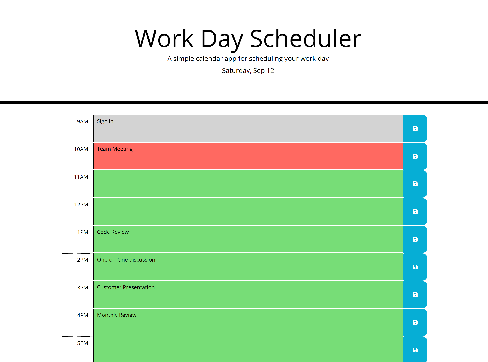

# Work-Day-Scheduler

## The Repository

The link to the website repository: [Website Repo link](https://github.com/NavdeepDP/Work-Day-Scheduler)

The site is published at [Published Website link](https://navdeepdp.github.io/Work-Day-Scheduler/)

## Development Environment
Code is developed in VS code Studio

## Website Functionality

- The functionality helps the user to manage the working hours(9am - 6 pm) by saving the todo items/events in the calender.
 

- Past hours are displayed in gray color, present in red and future hours in green color coding.
  For example if the current time is 10:15 am, the 9AM time block is in gray, 10AM time block is in red and future time 
  blocks are in green color code.

- User can click any block ,  enter the event or task to be done and click the save button on right for the corresponding 
time block.

- On reloading or refreshing the page, saved events will be displayed.

## Installation

- Code is developed using VS Code studio.
- Code is available at the GITHub repository link: [Website Repo link](https://github.com/NavdeepDP/Work-Day-Scheduler)
- Get the code code in your local machine by using the clone option in the repository link.
- Click "Code" and copy the Clone with SSH key link.
- In Git bash, go to the appropriate directory and get the code using "git clone" command.
- Open index.html. Right click and open in browser of your choice to view the website.

## References

- [w3schools.com](https://www.w3schools.com/)
- [MDN web docs](https://developer.mozilla.org/en-US/docs/Web/JavaScript)
- [Moment.js documentation](https://momentjs.com/)

